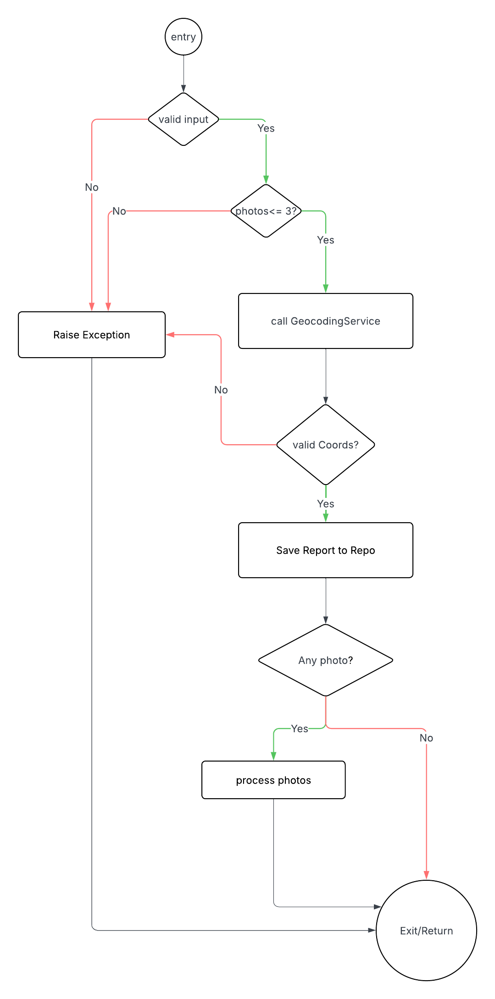
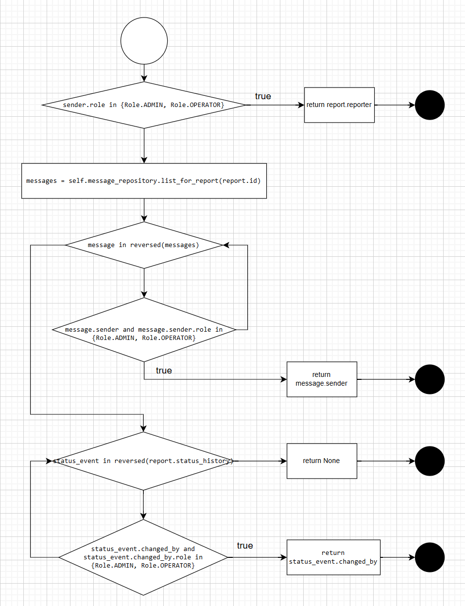
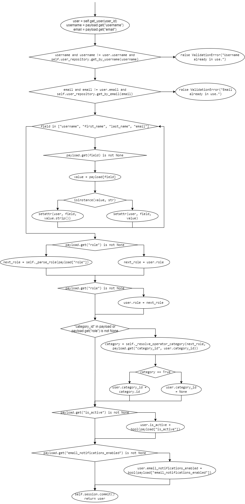

## 1 `ReportService.create_report`

### Control Flow Graph

- 

<!-- -  -->

### Atomic Conditions
| TC-ID |  Atomic conditions |
| :---- | :------------- |
| A1 | report_data is None |
| A2 | len(report_data.photos) > 3 |
| A3 | GeocodingService returns valid coordinates |
| A4 | author_id is None |

### Structural Lower Bound

The structural lower bound for this method is 3. This number represents the minimum set of independent paths required to reach full structural coverage based on the function's decision logic.

I identified three main scenarios that drive the control flow:

Path 1: The validation check at the start fails (e.g., report_data is missing), leading to an early ValueError.
Path 2: The input is valid, but the report has zero photos, meaning the photo-processing loop is skipped entirely.
Path 3: The input is valid and includes photos, which forces the execution to enter and process the photo loop.

Since these three paths are enough to hit every node and edge in the graph, the lower bound is logically 3.

### Node Coverage
| TC-ID | N1 | N2 | N3 |
| :---- | :--- | :--- | :--- | 
| T1 | "Yes" | "Yes" | "No" | 
| T2|  "Yes" | "Yes" | "Yes" |
| T3 | "Yes" | "Yes" | "Yes" | 

### Edge Coverage
| Edge | Covered by |
| :--- | :--- |
| N1 -> N2 | T1, T2, T3 |
| N2 -> N8 | T1 |
| N2 -> N3 | T2, T3 |
| N3 -> N4 | T2, T3 |
| N4 -> N5 | T2, T3 |
| N5 -> N6 | T2, T3 |
| N6 -> N7 | T3 |
| N6 -> N9 | T2 |
| N8 -> N9 | T1 |
| N7 -> N9 | T3 |
### Condition Coverage

| TC-ID | `report_data` is valid | Photos count <= 3 | Coords are valid |
| :---- | :------------- | :------------- | :------------- |
| T1 | False | - | - |
| T2 | True | True | True |
| T3 | True | True | True |

### Loop Coverage

| TC-ID | 0 iteration | 1 iteration | 2+ iteration |
| :---- | :---------- | :--------- | :------- |
| T1 | "Yes" | "No" | "No" |
| T2 | "Yes" | "No" | "No" |
| T3 | "No" | "No" | "Yes" (3 photos) |

### Path Coverage
| TC-ID | Path |
| :---- | :------------- | 
| T1 | N1->N2->N8->N9 (Input Error) |
| T2 | N1->N2->N3->N4->N5->N6->N9 (Success without photos) |
| T3 | N1->N2->N3->N4->N5->N6->N7->N9 (Success with photos) |
### Minimal Suite Test

| TC-ID | Setup / Input |
| :---- | :------------- |
| **LB** | 3 test cases[cite: 3] |
| **T1** | `report_data = None` -> Expect `ValueError` |
| **T2** | `report_data` valid, `photos = []` -> Mock Geocoding to return valid coords |
| **T3** | `report_data` valid, `photos = [p1, p2, p3]` -> Verify loop execution and repo save |

## 2 `MessagingService._resolve_recipient`

### Control Flow Graph

- ()

### Atomic Conditions

| TC-ID |  Atomic conditions |
| :---- | :------------- |
| A1 | sender.role is in {Role.ADMIN, Role.OPERATOR} |
| A2 | message.sender is not None |
| A3 | message.sender.role is in {Role.ADMIN, Role.OPERATOR}|
| A4 | status_event.changed_by is not None |
| A5 | status_event.changed_by.role is in {Role.ADMIN, Role.OPERATOR}|

### Structural Lower Bound

structural lower bound = 4

| TC-ID | Sender.role condition | message loop | status loop | return |
| :---- | :------------- | :------------- | :------------- |:------------- |
| P1 | true | does not enter loop | does not enter loop | report.reporter |
| P2 | false | if condition true | does not enter loop | message.sender |
| P3 | false | exhausts loop | exhausts loop | None |
| P4 | false | exhausts loops | if condition true | status_event.changed_by |

### Node Coverage

N1: start
N2: sender role check
N3: return report.reporter
N4: fetch messages
N5: messages for loop
N6: messages sender check
N7: return message.sender
N8: status for loop
N9: status change checker
N10: return status_event.changed_by
N11: return None
N12: exit

Node coverage: 100%

| TC-ID | N1 | N2 | N3 | N4 | N5 | N6 | N7 | N8 | N9 | N10 | N11 | N12 |
| :--- | :--- | :--- | :--- | :--- | :--- | :--- | :--- | :--- | :--- | :--- | :--- | :--- | 
| P1 | "Yes" | "Yes" | "Yes" | "No" | "No" | "No" | "No" | "No" | "No" | "No" | "No" | "Yes" |
| P2 | "Yes" | "Yes" | "No" | "Yes" | "Yes" | "Yes" | "Yes" | "No" | "No" | "No" | "No" | "Yes" | 
| P3 | "Yes" | "Yes" | "No" | "Yes" | "Yes" | "Yes" | "No" | "Yes" | "Yes" | "No" | "Yes" | "Yes" |
| P4 | "Yes" | "Yes" | "No" | "Yes" | "Yes" | "Yes" | "No" | "Yes" | "Yes" | "Yes" | "No" | "Yes" |

### Edge Coverage

Edge coverage: 100%

| Edge | Covered by |
| :--- | :--- |
| N1 -> N2 | P1, P2, P3, P4|
| N2 -> N3 | P1 |
| N3 -> N12 | P1 |
| N2 -> N4 | P2, P3, P4 |
| N4 -> N5 | P2, P3, P4 |
| N5 -> N6 | P2, P3, P4 |
| N6 -> N5 | P3, P4|
| N6 -> N7 | P2 |
| N7 -> N12 | P2 |
| N5 -> N8 | P3, P4 |
| N8 -> N11 | P3 |
| N11 -> N12 | P3 |
| N8 -> N9 | P3, P4 |
| N9 -> N8 | P3 |
| N9 -> N10 | P4 |
| N10 -> N12 | P4 |

### Condition Coverage

Condition Coverage : 100%

| TC-ID | A1 | A2 | A3 | A4 | A5 |
| :---- | :----- | :----- | :----- |:----- | :-----|
| P1 | true | - | - | - | - |
| P2 | false | true | true | - | - |
| P3 | false | false| - | false | - |
| P4 | false | false | - | true | true | 
| P5 | false | true | false | - | - |
| P6 | false | false | - | true | false | 

### Loop Coverage

Loop coverage: 100%

| TC-ID | message loop 0 iteration | message loop 1 iteration | message loop 2+ iteration | status loop 0 iteration | status loop 1 iteration | status loop 2+ iteration |
| :---- | :---------- | :--------- | :------- | :---------- | :--------- | :------- |
| P1 | - | - | - | - | - | - |
| P2 | No | Yes | No | - | - | - |
| P3 | No | No | Yes | No | No | Yes |
| P4 | No | No | Yes | No | Yes | No |
| PL | Yes | No | No | Yes | No | No |

Such that PL: A1 = False, messages is empty, and status_history is empty. Therefore returns None with both loops at 0 iterations

### Path Coverage

| TC-ID | Path |
| :---- | :------------- | 
| P1 | N1->N2->N3->N12 |
| P2 | N1->N2->N4->N5->N6->N7->N12 |
| P3 | N1->N2->N4->N5->N6->N5->...->N8->N9->N8->...->N11->N12 |
| P4 | N1->N2->N4->N5->N6->N5->...->N8->N9->N10->N12 |

Path coverage not 100% since we have two loops, the number of possible paths is unfeasible (infinite).

### Minimal Suite Test

| TC-ID | Input | Output |
| :--- | :--- | :--- |
|P1|sender.role iis an ADMIN or OPERATOR| return report.reporter|
|P2|sender.role not an ADMIN or OPERATOR, messages list has one message sent by an ADMIN or OPERATOR| return message.sender|
|P3|sender.role not an ADMIN or OPERATOR, messages list not empty but no qualified message sender, status list not empty but no qualifying status event changed_by | return None |
|P4|sender.role not an ADMIN or OPERATOR, messages list not empty but no qualified message sender, status list not empty but has one event with ADMIN/OPERATOR changed_by | return status_event.changed_by |
|P5|sender.role not an ADMIN or OPERATOR, messages list not empty and has one message where sender exists but not ADMIN/OPERATOR | conintues to status loop |
|P6|sender.role not an ADMIN or OPERATOR, status list has one event where changed_by exists but role not ADMIN/OPERATOR | returns None |
|PL|sender.role not an ADMIN or OPERATOR, message list empty, status list empty | returns None |

## 3 `NotificationService.notify_status_change`

### Control Flow Graph

- 

### Atomic Conditions
| TC-ID |  Atomic conditions |
| :---- | :------------- |
| A1 | recipient is None |
| A2 | recipient.id in seen |

### Structural Lower Bound
We have one decision and one for loop, so basically we have to do twice decisions.
1. "if" decision checks "recipient is None or recipient.id in seen", we should individually check the condition that "recipient is None" and "recipient.id in seen"
2. it also should checks the end of the list of recipients
So, depending on above information, N4("recipient is None", T/F)->N8(T/F) and N4("recipient.id in seen", T/F)->N8(T/F). But whatever in which test cases, the exit function must be excuted, and also "recipient is None" and "recipient.id" in true condition are going to same path, vice versa, total_condition_path - repeated_condtion_path = 6-2-1=3. So, Lower Bound = 3.

### Node Coverage
| TC-ID | N1 | N2 | N3 | N4 | N5 | N6 | N7 | N8 | N9 |
| :---- | :--- | :--- | :--- | :--- | :--- | :--- | :--- | :--- | :--- |
| T1 | "Yes" | "Yes" | "Yes" | "No" | "No" | "No" | "No"  | "Yes" | "Yes" |
| T2|  "Yes" | "Yes" | "Yes" | "No" | "Yes" | "Yes" | "No"  | "Yes" | "Yes" |
| T3 | "Yes" | "Yes" | "Yes" | "Yes" | "Yes" | "Yes" | "Yes"  | "Yes" | "Yes" |
ALL NODES HAVE COVERED AND ALSO INCLUDE THE CONDITION CASE( IF )

N1 = function entry
N2 = seen = set()
N3 = extract recipient from recipients
N4 = recipient is None or recipient.id in seen
N5 = seen.add(recipient.id)
N6 = create_notification(...)
N7 = finish current loop + next loop
N8 = have more recipients?
N9 = exit function

### Edge Coverage
| Edge | Covered by |
| :--- | :--- |
| N1 -> N2 | T1, T2, T3 |
| N2 -> N3 | T1, T2, T3 |
| N3 -> N4 | T1, T2, T3 |
| N4 -> N5 | T2, T3 |
| N5-> N6 | T2, T3 |
| N6 -> N8 | T2, T3 |
| N8 -> N9 | T1, T2, T3 |
| N4 -> N7 | T1, T3 |
| N7 -> N8 | T1, T3 |
| N8 -> N3 | T3 |
ALL EDGES ARE COVERED
  
### Condition Coverage
| TC-ID | recipient is None  | recipient.id in seen |
| :---- | :------------- |  :------------- |
| T1 | True | False |
| T2 | False | False |
| T3_first_loop | True | False |
| T3_second_loop | False | True |
so in the case test 3, all the conditions have triggered T/F boolean
100% COVERAGE

### Loop Coverage
| TC-ID | 0 iteration | 1 iteration | 2+ iteration |
| :---- | :---------- | :--------- | :------- |
| T1 | "Yes" | "NO" | "YES" |
| T2 | "NO" | "YES" | "NO" |
| T3 | "NO" | "NO" | "YES" |
100% COVERAGE
 
### Path Coverage
| TC-ID | Path |
| :---- | :------------- | 
| T1 | N1->N2->N3->N4(T)->N7->N8(F)->N9 |
| T2 | N1->N2->N3->N4(F)->N5->N6->N8(F)->N9 |
| T3 | N1->N2->N3->N4(T)->N8(T)->N3->N4(F)->N5->N6->N8(T)->N3->N4(T)->N7->N8(T)->N3->N4(F)->N5->N6->N8(F)->N9 |
ONLY 3 PATH BUT IT CAN COVER ALL EDGES AND NODES AND CONDITIONS

### Minimal Suite Test
| TC-ID | the number of Lower Bound |
| :---- | :------------- |
| LB | 3 test cases | 
| T1 :recipients = [] |
| T2: recipients = [user1] |
| T3: recipients = [None, user1, user1, user2/user1] |

## 4 `NotificationService.count_unread_message_notifications_by_report`

### Control Flow Graph

- 

### Atomic Conditions

### Structural Lower Bound

### Node Coverage

### Edge Coverage

### Condition Coverage

### Loop Coverage

### Path Coverage

### Minimal Suite Test

## 5 `UserService.update_user`

### Control Flow Graph

- 

### Atomic Conditions

| D-ID | Decision | Atomic Conditions |
| :--- | :------- | :---------------- |
| D1 | if username and username != user.username and self.user_repository.get_by_username(username) | C1: username   C2: username != user.username   C3: self.user_repository.get_by_username(username) |
| D2 | if email and email != user.email and self.user_repository.get_by_email(email) | C4: email   C5: email != user.email   C6: self.user_repository.get_by_email(email) |
| D3 | if payload.get(field) is not None | C7: payload.get(field) is not None |
| D4 | if isinstance(value, str) | C8: isinstance(value, str) |
| D5 | if payload.get("role") is not None | C9: payload.get("role") is not None |
| D6 | if "category_id" in payload or payload.get("role") is not None | C10: "category_id" in payload   C11: payload.get("role") is not None |
| D7 | if payload.get("role") is not None | C11: payload.get("role") is not None |
| D8 | if payload.get("is_active") is not None | C12: payload.get("is_active") is not None |
| D9 | if payload.get("email_notifications_enabled") is not None | C13: payload.get("email_notifications_enabled") is not None |

### Structural Lower Bound

Structural lower bound = 13  
At least 13 test cases are necessary to cover all the different paths

### Node Coverage

| TC-ID | user_id | payload | Expected | Fixture | Notes |
| :---- | :------ | :------ | :------- | :------ | :---- |
| TC-NC-5.1 | 102 | {"username": "luca.bianchi"} | raise `ValidationError("Username already in use.")` | EXISTING_USER | cover the first raise |
| TC-NC-5.2 | 102 | {"username": "valid.username", "email": "existing.email@test.com"} | raise `ValidationError("Email already in use.")` | EXISTING_USER | cover the second raise |
| TC-NC-5.3 | 102 | {"username": "valid.username", "email": "valid.email@test.com", "first_name": "Mario", "role": "OPERATOR", "category_id": 5, "is_active": False, "email_notifications_enabled": True} | return updated `User` object | - | cover all the other nodes and the commit |

100% node coverage with TC-NC-5.1, TC-NC-5.2, TC-NC-5.3

### Edge Coverage

| TC-ID | user_id | payload | Expected | Fixture | Notes |
| :---- | :------ | :------ | :------- | :------ | :---- |
| TC-EC-5.1 | 102 | {"username": "luca.bianchi"} | raise `ValidationError("Username already in use.")` | EXISTING_USER | cover IF-1 -> True |
| TC-EC-5.2 | 102 | {"username": "valid.username", "email": "existing.email@test.com"} | raise `ValidationError("Email already in use.")` | EXISTING_USER | cover IF-1 -> False, IF-2 -> True |
| TC-EC-5.3 | 102 | {"username": "valid.username", "email": "valid.email@test.com", "first_name": "Mario", "role": "OPERATOR", "category_id": 5, "is_active": False, "email_notifications_enabled": True} | return updated `User` object | - | cover IF-1 -> False, IF-2 -> False, IF-3 -> True, IF-4 -> True, IF-5 -> True, IF-6 -> True, IF-7 -> True, IF-8 -> True |
| TC-EC-5.4 | 102 | {} | return `User` object | - | cover IF-1 -> False, IF-2 -> False, IF-3 -> False, IF-4 -> False, IF-5 -> False, IF-6 -> False, IF-7 -> False, IF-8 -> False |

100% edge coverage with TC-EC-5.1, TC-EC-5.2, TC-EC-5.3, TC-EC-5.4

### Condition Coverage

| TC-ID | user_id | payload | Expected | Fixture | Notes |
| :---- | :------ | :------ | :------- | :------ | :---- |
| TC-CC-5.1 | 102 | {"username": "valid.username", "first_name": " Mario ", "email": "valid.email@test.com", "role": "OPERATOR", "category_id": 10, "is_active": True, "email_notifications_enabled": True} | return updated `User` object | - | cover C1, C2, C4, C5, C7, C8, C9, C10, C11, C12, C13 as **True**   C3, C6 as **False** |
| TC-CC-5.2 | 102 | {} | return `User` object | - | cover C1, C4, C7, C9, C10, C12, C13 as **False** |
| TC-CC-5.3 | 102 | {"username": "luca.bianchi"} | raise `ValidationError("Username already in use.")` | EXISTING_USER | cover C3 as **True** |
| TC-CC-5.4 | 102 | {"email": "existing.email@test.com"} | raise `ValidationError("Email already in use.")` | EXISTING_USER | cover C6 as **True** |
| TC-CC-5.5 | 102 | {"username: "old.username", "old.email@test.com"} | return updated `User` object | TEST_USER | cover C2, C5 as **False** |
| TC-CC-5.6 | 102 | {"first_name": 12345} | return updated `User` object | - | cover C8 as **False** |
| TC-CC-5.7 | 102 | {"category_id": 99} | return `User` object | - | cover C10 as **True**   C11 as **False** |
| TC-CC-5.8 | 102 | {"role": "OPERATOR"} | return `User` object | - | cover C10 as **False**   C11 as **True** |

100% condition coverage with TC-CC-5.1, TC-CC-5.2, TC-CC-5.3, TC-CC-5.4, TC-CC-5.5, TC-CC-5.6, TC-CC-5.7, TC-CC-5.8

### Loop Coverage

*Not necessary* - the loop is always executed 4 times

### Path Coverage

The number of different paths is 2^n where n is the number of indipendent decisions. Because of that, the number of different paths increases exponentially. So reaching a 100% path coverage is impraticable.

Instead we consider the *Basis Path Testing*. We consider a minimal set of indipendent paths.

| TC-ID | user_id | payload | Expected | Fixture | Path |
| :---- | :------ | :------ | :------- | :------ | :---- |
| TC-PC-5.1 | 102 | {} | return `User` object | - | 1 -> 2(F) -> 3(F) -> 4(fine) -> 8(F) -> 9(F) -> 10(F) -> 11(F) -> 12 |
| TC-PC-5.2 | 102 | {"username": "old.username"} | return `User` objec | TEST_USER | 1 -> 2(C1:T, C2:F) -> 3(F) -> 4(fine) -> 8(F) -> 9(F) -> 10(F) -> 11(F) -> 12 |
| TC-PC-5.3 | 102 | {"username": "valid.username"} | return `User` object | - | 1 -> 2(C1:T, C2:T, C3:F) -> 3(F) -> 4(fine) -> 8(F) -> 9(F) -> 10(F) -> 11(F) -> 12 |
| TC-PC-5.4 | 102 | {"username": "luca.bianchi"} | raise `ValidationError("Username already in use.")` | EXISTING_USER | 1 -> 2(C1:T, C2:T, C3:T) -> 2a (EXIT) |
| TC-PC-5.5 | 102 | {"email": "old.email@test.com"} | return `User` object | TEST_USER | 1 -> 2(F) -> 3(C4:T, C5:F) -> 4(fine) -> 8(F) -> 9(F) -> 10(F) -> 11(F) -> 12 |
| TC-PC-5.6 | 102 | {"email": "valid.email@test.com"} | return `User` object | - | 1 -> 2(F) -> 3(C4:T, C5:T, C6:F) -> 4(fine) -> 8(F) -> 9(F) -> 10(F) -> 11(F) -> 12 |
| TC-PC-5.7 | 102 | {"email": "existing.email@test.com"} | raise `ValidationError("Email already in use.")` | EXISTING_USER | 1 -> 2(F) -> 3(C4:T, C5:T, C6:T) -> 3a (EXIT) |
| TC-PC-5.8 | 102 | {"first_name": "Mario"} | return `User` object | - | ... -> 4(iter) -> 5(T) -> 6(T) -> 7 -> 4(fine) -> ... -> 12 |
| TC-PC-5.9 | 102 | {"first_name": 123} | return `User` object | - | ... -> 4(iter) -> 5(T) -> 6(F) -> 7 -> 4(fine) -> ... -> 12 |
| TC-PC-5.10 | 102 | {"role": "OPERATOR"} | return `User` object | - | ... -> 8(T) -> 9(T, via C11) -> ... -> 12 |
| TC-PC-5.11 | 102 | {"category_id": 10} | return `User` object | - | ... -> 8(F) -> 9(T, via C10) -> ... -> 12 |
| TC-PC-5.12 | 102 | {"is_active": True} | return `User` object | - | ... -> 10(T) -> 11(F) -> 12 |
| TC-PC-5.13 | 102 | {"email_notifications_enabled": True} | return `User` object | - | ... -> 10(F) -> 11(T) -> 12 |

#### Paths Nodes Legend

- [1]: Inizio + get_user

- [2]: if username and ... (Decisione Username)

- [2a]: raise ValidationError (Username)

- [3]: if email and ... (Decisione Email)

- [3a]: raise ValidationError (Email)

- [4]: for field in [...] (Inizio/Iterazione Ciclo)

- [5]: if payload.get(field) is not None (Decisione campo presente)

- [6]: if isinstance(value, str) (Decisione tipo stringa)

- [7]: Aggiornamento campo (setattr)

- [8]: if payload.get("role") is not None (Decisione Ruolo)

- [9]: if "category_id" in payload or ... (Decisione Categoria)

- [10]: if payload.get("is_active") is not None (Decisione Active)

- [11]: if payload.get("email_notifications_enabled") is not None (Decisione Notifiche)

- [12]: session.commit() + return (Fine)

### Minimal Suite Test

TC-PC-5.1, TC-PC-5.2, TC-PC-5.3, TC-PC-5.4, TC-PC-5.5, TC-PC-5.6, TC-PC-5.7, TC-PC-5.8, TC-PC-5.9, TC-PC-5.10, TC-PC-5.11, TC-PC-5.12, TC-PC-5.13, TC-NC-5.3

- 100% Node Coverage
- 100% Edge Coverage
- 100% Condition Coverage
- 100% Basis Path Coverage